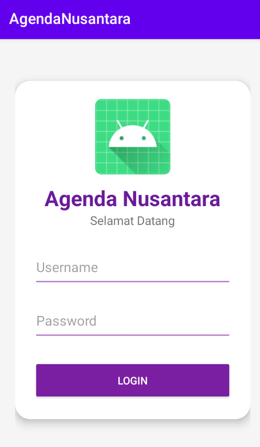
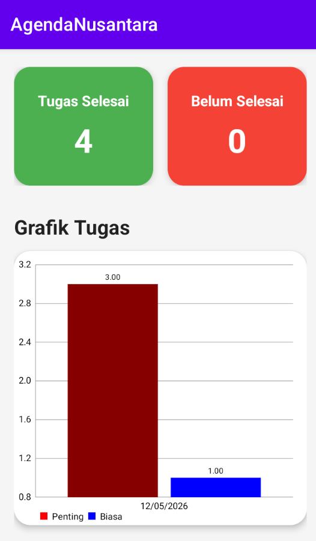

# AgendaNusantara

Aplikasi manajemen agenda dan kegiatan berbasis web untuk membantu pengguna dalam mengatur jadwal, mencatat agenda penting, dan memantau aktivitas secara lebih terstruktur.

## 📌 Tentang Project

**AgendaNusantara** adalah aplikasi web yang dirancang untuk mempermudah pengelolaan agenda harian maupun kegiatan tertentu. Project ini dikembangkan menggunakan teknologi web modern dengan tujuan memberikan sistem pencatatan agenda yang sederhana, responsif, dan mudah digunakan.

Repository GitHub:
[AgendaNusantara Repository](https://github.com/yudhead/AgendaNusantara?utm_source=chatgpt.com)

---

## 🚀 Fitur Utama

* 🔐 Sistem Login & Autentikasi
* 📅 Manajemen Agenda / Jadwal
* 📝 Tambah, Edit, dan Hapus Agenda
* 📊 Dashboard Informasi Agenda
* 👤 Manajemen Data Pengguna
* 📱 Responsive Design
* 🔎 Pencarian Agenda
* 📂 Penyimpanan Data Terstruktur

---

## 📸 Tampilan Aplikasi


<div align="center">




</div>

## 📂 Struktur Folder

```bash
AgendaNusantara/
│── app/
│── bootstrap/
│── config/
│── database/
│── public/
│── resources/
│── routes/
│── storage/
│── tests/
│── vendor/
│── .env
│── artisan
│── composer.json
│── package.json
```

---

## ⚙️ Cara Install Project

### 1. Clone Repository

```bash
git clone https://github.com/yudhead/AgendaNusantara.git
```

### 2. Masuk ke Folder Project

```bash
cd AgendaNusantara
```

### 3. Install Dependency PHP

```bash
composer install
```

### 4. Install Dependency Frontend

```bash
npm install
```

### 5. Copy File Environment

```bash
cp .env.example .env
```

### 6. Generate Key Laravel

```bash
php artisan key:generate
```

### 7. Atur Database di `.env`

```env
DB_DATABASE=agendanusantara
DB_USERNAME=root
DB_PASSWORD=
```

### 8. Jalankan Migration

```bash
php artisan migrate
```

### 9. Jalankan Server

```bash
php artisan serve
```

Akses aplikasi melalui:

```bash
http://127.0.0.1:8000
```

---

## 📸 Tampilan Aplikasi

Tambahkan screenshot aplikasi di bagian ini.

```md

```

---

## 👨‍💻 Developer

Dikembangkan oleh:
**[yudhead GitHub](https://github.com/yudhead?utm_source=chatgpt.com)**

---

## 🤝 Contribution

Kontribusi sangat terbuka untuk pengembangan project ini.

Langkah contribution:

1. Fork repository
2. Buat branch baru
3. Commit perubahan
4. Push ke branch
5. Buat Pull Request

---

## 📜 License

Project ini menggunakan lisensi **MIT License**.

---

## ⭐ Support

Jika project ini membantu, jangan lupa untuk memberikan ⭐ pada repository GitHub.
